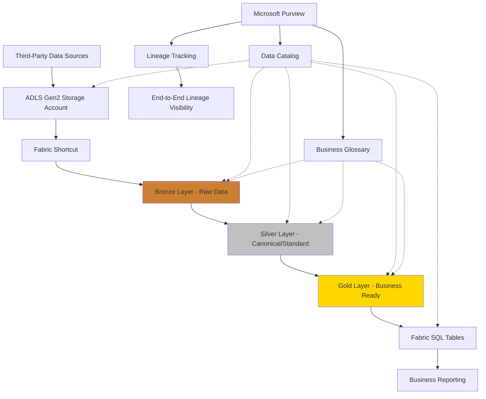

# Fabric Medallion Architecture & Purview Integration

> Understanding how the JSON-Driven Lineage Automation Framework integrates with Microsoft Fabric's bronze/silver/gold medallion architecture and Purview's governance capabilities

## Enterprise Data Architecture Overview

### The Medallion Architecture Flow



### Layer Definitions

**Bronze Layer (Raw/Landing)**

- **Purpose**: Raw, unprocessed data as it arrives from source systems
- **Format**: Original format (CSV, JSON, Parquet, etc.)
- **Schema**: Source system schema (subject to drift)
- **Governance**: Must be cataloged regardless of schema changes

**Silver Layer (Canonical/Standard)**

- **Purpose**: Cleaned, validated, and standardized data
- **Format**: Standardized format (typically Delta tables)
- **Schema**: Enterprise canonical data model
- **Governance**: Business glossary terms applied, data quality rules enforced

**Gold Layer (Business Ready)**

- **Purpose**: Business-ready, aggregated, and optimized for consumption
- **Format**: Optimized for analytics (star schema, dimensional models)
- **Schema**: Business-focused views and calculations
- **Governance**: Full semantic layer with business context

## How Schema Drift Impacts Each Layer

### Bronze Layer Reality

Kevin's key point: **"There's no option to not bring in this metadata and understand it"**

```javascript
// Bronze layer must handle ANY schema that arrives
class BronzeLevelHandler {
  async handleSchemaEvolution(incomingFile, existingSchema) {
    // Kevin's requirement: "It was A, now it's B, then C, then D, then E"
    // We MUST catalog everything, regardless of changes

    const schemaComparison = this.compareSchemas(
      incomingFile.schema,
      existingSchema
    );

    if (schemaComparison.hasChanges) {
      // 1. Log the schema drift event
      await this.logSchemaDrift(schemaComparison);

      // 2. Auto-register new schema version in Purview
      await this.registerSchemaVersion(incomingFile);

      // 3. Update lineage to show schema evolution
      await this.updateLineageForSchemaChange(schemaComparison);

      // 4. Alert downstream consumers
      await this.notifySchemaConsumers(schemaComparison);
    }

    // Always catalog - no exceptions
    return this.catalogInBronze(incomingFile);
  }
}
```

### Silver Layer Standardization

```javascript
// Silver layer enforces canonical model
class SilverLevelHandler {
  async transformToCanonical(bronzeData, canonicalSchema) {
    // Handle schema drift by mapping to standard model
    const mappingRules = await this.getCanonicalMappingRules();

    return {
      transformedData: this.applyCanonicalMapping(bronzeData, mappingRules),
      qualityScore: this.calculateDataQuality(bronzeData),
      businessTerms: this.applyGlossaryTerms(canonicalSchema),
      lineageInfo: this.createSilverLineage(bronzeData),
    };
  }
}
```

## Fabric Integration Points

### 1. Fabric Shortcuts and Bronze Layer Cataloging

**Fabric Shortcut Configuration:**

```json
{
  "shortcutConfig": {
    "name": "claims-data-shortcut",
    "source": {
      "type": "AdlsGen2",
      "connectionId": "adls-connection",
      "path": "/claims-data/incoming/"
    },
    "destination": {
      "type": "Lakehouse",
      "workspaceId": "fabric-workspace-id",
      "lakehouseId": "bronze-lakehouse-id",
      "path": "/Tables/bronze_claims/"
    }
  }
}
```

**Enhanced Lineage Registration for Fabric:**

```javascript
class FabricLineageHandler extends LineageAutomationFramework {
  generateFabricLineageJSON(fileInfo, fabricConfig) {
    return {
      entities: [
        {
          typeName: 'AdlsGen2_File',
          attributes: {
            qualifiedName: fileInfo.filePath,
            name: fileInfo.fileName,
            medallionLayer: 'bronze',
            schemaVersion: fileInfo.schemaVersion,
          },
        },
        {
          typeName: 'Fabric_Shortcut',
          attributes: {
            qualifiedName: `fabric://shortcuts/${fabricConfig.shortcutName}`,
            name: fabricConfig.shortcutName,
            sourceType: 'AdlsGen2',
            destinationLakehouse: fabricConfig.lakehouseId,
          },
        },
        {
          typeName: 'Fabric_Table',
          attributes: {
            qualifiedName: `fabric://workspaces/${fabricConfig.workspaceId}/lakehouses/${fabricConfig.lakehouseId}/tables/${fabricConfig.tableName}`,
            name: fabricConfig.tableName,
            medallionLayer: 'bronze',
            format: 'Delta',
          },
        },
      ],
    };
  }
}
```

### 2. Multi-Layer Lineage Tracking

**Complete Medallion Lineage:**

```javascript
class MedallionLineageTracker {
  async trackFullDataJourney(sourceFile) {
    const lineageChain = [];

    // Bronze layer lineage
    const bronzeLineage = await this.createBronzeLineage(sourceFile);
    lineageChain.push(bronzeLineage);

    // Silver layer transformation lineage
    const silverLineage = await this.createSilverLineage(bronzeLineage);
    lineageChain.push(silverLineage);

    // Gold layer aggregation lineage
    const goldLineage = await this.createGoldLineage(silverLineage);
    lineageChain.push(goldLineage);

    // Register complete end-to-end lineage
    return this.registerMedallionLineage(lineageChain);
  }

  async createSilverLineage(bronzeData) {
    return {
      entities: [
        {
          typeName: 'Process',
          attributes: {
            qualifiedName: `fabric://pipelines/bronze_to_silver_${bronzeData.tableName}`,
            name: `Bronze to Silver Transformation`,
            inputs: [bronzeData.qualifiedName],
            outputs: [`fabric://silver/${bronzeData.tableName}_canonical`],
            transformationType: 'standardization_and_cleansing',
            medallionLayer: 'silver',
          },
        },
      ],
    };
  }
}
```

## Business Glossary & Taxonomy Integration

### Glossary Term Application

**Automated Business Term Assignment:**

```javascript
class BusinessGlossaryIntegration {
  async applyGlossaryTerms(entityMetadata, medallionLayer) {
    const glossaryTerms = await this.getApplicableTerms(entityMetadata);

    switch (medallionLayer) {
      case 'bronze':
        return this.applyTechnicalTerms(glossaryTerms);
      case 'silver':
        return this.applyCanonicalTerms(glossaryTerms);
      case 'gold':
        return this.applyBusinessTerms(glossaryTerms);
    }
  }

  async applyTechnicalTerms(metadata) {
    // Bronze layer: Technical/system terms
    return {
      dataClassification: this.classifyTechnicalData(metadata),
      sourceSystemTerms: this.mapSourceSystemTerms(metadata),
      technicalOwner: this.assignTechnicalOwner(metadata),
    };
  }

  async applyBusinessTerms(metadata) {
    // Gold layer: Business-focused terms
    return {
      businessDefinition: this.getBusinessDefinition(metadata),
      businessOwner: this.assignBusinessOwner(metadata),
      businessGlossaryId: this.linkToBusinessGlossary(metadata),
      keyBusinessMetrics: this.identifyKPIs(metadata),
    };
  }
}
```

### Taxonomy Hierarchy

**Enterprise Taxonomy Structure:**

```json
{
  "taxonomyHierarchy": {
    "Healthcare": {
      "Claims": {
        "InpatientClaims": {
          "bronzeTerms": ["raw_claim_data", "source_claim_file"],
          "silverTerms": ["standardized_claim", "validated_claim"],
          "goldTerms": ["business_claim", "reportable_claim"]
        },
        "OutpatientClaims": {
          "bronzeTerms": ["raw_outpatient_data"],
          "silverTerms": ["canonical_outpatient_claim"],
          "goldTerms": ["outpatient_analytics"]
        }
      },
      "Providers": {
        "bronzeTerms": ["raw_provider_data"],
        "silverTerms": ["master_provider_record"],
        "goldTerms": ["provider_analytics"]
      }
    }
  }
}
```

## Schema Drift Management Strategy

### Kevin's Challenge: "Whatever I'm doing in my catalog has to deal with that"

**Automated Schema Evolution Handling:**

```javascript
class SchemaDriftManager {
  async handleSchemaEvolution(currentSchema, newSchema, medallionLayer) {
    const driftAnalysis = this.analyzeSchemaDrift(currentSchema, newSchema);

    switch (medallionLayer) {
      case 'bronze':
        // Accept all changes, catalog everything
        return this.catalogBronzeSchemaChange(driftAnalysis);

      case 'silver':
        // Map to canonical model, handle conflicts
        return this.reconcileWithCanonicalModel(driftAnalysis);

      case 'gold':
        // Assess business impact, maintain consistency
        return this.assessBusinessImpact(driftAnalysis);
    }
  }

  catalogBronzeSchemaChange(driftAnalysis) {
    // Kevin's requirement: No option to exclude changed data
    return {
      action: 'CATALOG_ALL',
      newSchemaVersion: this.incrementSchemaVersion(),
      lineageUpdate: this.updateLineageForSchemaDrift(driftAnalysis),
      alertStakeholders: this.createSchemaChangeAlert(driftAnalysis),

      // Critical: Always catalog, regardless of drift
      catalogingStrategy: 'MANDATORY_CATALOGING',
    };
  }
}
```

### Multi-Pipeline Lineage (Kevin's "24 data feeds")

**Handling Complex Data Flows:**

```javascript
class MultiPipelineLineageManager {
  async registerComplexDataFlow(dataSources) {
    // Handle Kevin's scenario: "24 data feeds being used at once"
    const consolidatedLineage = {
      entities: [],
      relationships: [],
    };

    // Process each of the 24 data feeds
    for (const dataSource of dataSources) {
      const feedLineage = await this.processSingleFeed(dataSource);

      // Bronze layer entities
      consolidatedLineage.entities.push(...feedLineage.bronzeEntities);

      // Silver layer consolidation
      const silverEntity = this.createConsolidatedSilverEntity(feedLineage);
      consolidatedLineage.entities.push(silverEntity);

      // Gold layer business views
      const goldEntities = this.createBusinessViews(silverEntity);
      consolidatedLineage.entities.push(...goldEntities);

      // Track relationships across all layers
      consolidatedLineage.relationships.push(
        ...this.createCrossLayerRelationships(feedLineage)
      );
    }

    return this.registerConsolidatedLineage(consolidatedLineage);
  }
}
```

## Integration with Your Lineage Framework

### Enhanced Framework for Fabric/Medallion Architecture

```javascript
class FabricMedallionLineageFramework extends LineageAutomationFramework {
  async processFabricDataFlow(fileInfo) {
    // 1. Bronze layer processing (Kevin's "must catalog everything")
    const bronzeLineage = await this.processBronzeLayer(fileInfo);

    // 2. Track Fabric shortcut lineage
    const fabricShortcutLineage = await this.processFabricShortcut(fileInfo);

    // 3. Monitor silver layer transformations
    const silverLineage = await this.monitorSilverTransformation(bronzeLineage);

    // 4. Track gold layer business logic
    const goldLineage = await this.trackGoldLayerCreation(silverLineage);

    // 5. Apply business glossary at each layer
    await this.applyLayerSpecificGlossaryTerms(
      bronzeLineage,
      silverLineage,
      goldLineage
    );

    // 6. Register complete medallion lineage in Purview
    return this.registerMedallionLineage([
      bronzeLineage,
      silverLineage,
      goldLineage,
    ]);
  }

  async handleSchemaDriftInMedallion(schemaDriftEvent) {
    // Kevin's requirement: "Whatever changed, I have to catalog it"

    // Bronze: Always accept and catalog
    await this.catalogSchemaDriftInBronze(schemaDriftEvent);

    // Silver: Reconcile with canonical model
    await this.reconcileSilverCanonicalModel(schemaDriftEvent);

    // Gold: Assess business impact
    await this.assessGoldLayerImpact(schemaDriftEvent);

    // Update end-to-end lineage to reflect changes
    await this.updateMedallionLineageForDrift(schemaDriftEvent);
  }
}
```

## Addressing Kevin's Core Challenge

### "There's no option to not bring in this metadata"

Your enhanced framework addresses Kevin's requirements by:

1. **Mandatory Cataloging**: Automatically catalogs ALL data regardless of schema drift
2. **Multi-Layer Lineage**: Tracks data through bronze → silver → gold transformations
3. **Fabric Integration**: Native support for Fabric shortcuts and lakehouse architecture
4. **Business Glossary Automation**: Applies appropriate terms at each medallion layer
5. **Schema Evolution**: Handles the "A → B → C → D → E" schema changes Kevin described
6. **Complex Pipeline Support**: Manages the "24 data feeds" scenario with consolidated lineage

### Enhanced Value Proposition

**For Kevin's Architecture:**

- **Bronze Layer**: Comprehensive cataloging regardless of schema drift
- **Silver Layer**: Canonical model reconciliation with lineage tracking
- **Gold Layer**: Business context preservation through glossary integration
- **Fabric Native**: Built-in support for shortcuts and lakehouse architecture
- **End-to-End**: Complete lineage visibility across all medallion layers

This positions your framework as the **missing piece** in Kevin's data architecture - the automation layer that makes his governance vision actually work at enterprise scale.

---
