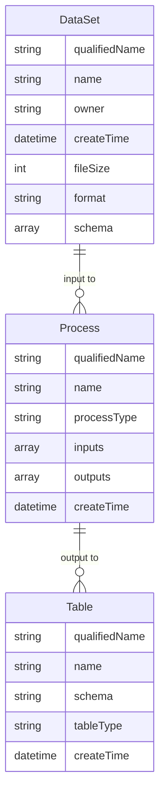

# Technical Approach: JSON-Driven Lineage Automation

## Architecture Overview

This document provides detailed technical specifications for the JSON-driven lineage automation framework designed to integrate with Microsoft Purview for automated data lineage registration.

## Core Technical Challenge

Microsoft Purview provides excellent capabilities for data discovery and cataloging, but lacks native automation for end-to-end lineage registration across complex data transformation workflows. Specifically:

- **Purview Scans**: Can catalog and classify metadata, but are scheduled/manual and don’t register custom lineage
- **ADF Lineage**: Only captures lineage for natively supported activities, missing custom transformations
- **Manual Registration**: Time-intensive and doesn’t scale with dynamic data environments

## Solution Architecture

### 1. Directory Monitoring System

**Technology Stack:**

- Azure Blob Storage SDK for real-time file detection
- Event Grid integration for immediate file notifications
- Power Automate for workflow orchestration

**Implementation Pattern:**

```javascript
// Real-time file detection using Azure SDK
const { BlobServiceClient } = require('@azure/storage-blob');

class FileMonitor {
  async scanForNewFiles(containerName, lastScanTime) {
    const blobServiceClient = new BlobServiceClient(connectionString);
    const containerClient = blobServiceClient.getContainerClient(containerName);

    const newFiles = [];
    for await (const blob of containerClient.listBlobsFlat()) {
      if (blob.properties.lastModified > lastScanTime) {
        newFiles.push(await this.extractMetadata(blob));
      }
    }
    return newFiles;
  }
}
```

### 2. Dynamic Pipeline Mapping

**Mapping Strategy:**

- File naming convention analysis
- Metadata-driven configuration tables
- Machine learning-based pattern recognition (future enhancement)

**Configuration Format:**

```json
{
  "mappingRules": [
    {
      "pattern": "claims_\\d{4}_\\d{2}_\\d{2}\\.csv",
      "pipeline": {
        "name": "transform_claims_pipeline",
        "destination": "processed_claims",
        "transformationType": "standardization_and_validation"
      }
    }
  ]
}
```

### 3. JSON Payload Generation

**Entity Relationship Model:**



**JSON Generation Logic:**

```javascript
generateLineageJSON(fileInfo, pipelineConfig) {
    const entities = [
        {
            typeName: "DataSet",
            attributes: {
                qualifiedName: this.buildQualifiedName('adls', fileInfo),
                name: fileInfo.fileName,
                description: `Source file for ${pipelineConfig.transformationType}`,
                owner: "External_Data_Provider",
                createTime: new Date().toISOString(),
                fileSize: fileInfo.fileSize,
                format: this.detectFileFormat(fileInfo.fileName),
                schema: fileInfo.schema
            },
            guid: this.generateGuid(),
            status: "ACTIVE"
        },
        // Process and Table entities...
    ];

    return { entities, referredEntities: {}, guidAssignments: {} };
}
```

### 4. Purview REST API Integration

**Authentication Flow:**

1. Service Principal authentication with Azure AD
1. Token acquisition for Purview scope
1. Secure token refresh mechanism

**API Implementation:**

```javascript
class PurviewClient {
  async authenticate() {
    const tokenRequest = {
      grant_type: 'client_credentials',
      client_id: this.clientId,
      client_secret: this.clientSecret,
      scope: 'https://purview.azure.net/.default',
    };

    const response = await axios.post(
      `https://login.microsoftonline.com/${this.tenantId}/oauth2/v2.0/token`,
      new URLSearchParams(tokenRequest)
    );

    this.accessToken = response.data.access_token;
  }

  async registerLineage(payload) {
    const url = `https://${this.purviewAccount}.purview.azure.com/datamap/api/atlas/v2/entity/bulk`;

    return await axios.post(url, payload, {
      headers: {
        Authorization: `Bearer ${this.accessToken}`,
        'Content-Type': 'application/json',
      },
    });
  }
}
```

## Scaling Considerations

### Performance Optimization

**Batch Processing:**

- Group related files for bulk registration
- Implement queue-based processing for high-volume scenarios
- Use async/await patterns for non-blocking operations

**Caching Strategy:**

- Cache pipeline mapping rules in memory
- Implement Redis for distributed caching in multi-instance deployments
- Cache Purview authentication tokens with automatic refresh

### Error Handling and Resilience

**Retry Logic:**

```javascript
async retryWithBackoff(operation, maxRetries = 3) {
    for (let attempt = 1; attempt <= maxRetries; attempt++) {
        try {
            return await operation();
        } catch (error) {
            if (attempt === maxRetries) throw error;

            const delay = Math.pow(2, attempt) * 1000; // Exponential backoff
            await this.delay(delay);
        }
    }
}
```

**Circuit Breaker Pattern:**

- Monitor API health and temporarily disable requests during outages
- Implement graceful degradation with local queuing
- Automatic service recovery detection

### Monitoring and Observability

**Metrics Collection:**

- File processing rates and success ratios
- API response times and error rates
- Lineage registration success metrics
- Schema drift detection counts

**Alerting Strategy:**

- Failed authentication alerts
- High error rate notifications
- Schema change notifications
- Processing backlog warnings

## Integration Patterns

### Power Automate Integration

```json
{
  "trigger": {
    "type": "BlobCreated",
    "container": "claims-data"
  },
  "actions": [
    {
      "type": "HTTP",
      "method": "POST",
      "uri": "https://your-function-app.azurewebsites.net/api/processFile",
      "body": {
        "fileName": "@{triggerBody().subject}",
        "containerName": "@{triggerBody().data.containerName}"
      }
    }
  ]
}
```

### Azure Functions Deployment

**Function Configuration:**

```javascript
module.exports = async function (context, eventGridEvent) {
  const { fileName, containerName } = eventGridEvent.data;

  const framework = new LineageAutomationFramework(config);
  await framework.processFile(fileName, containerName);

  context.res = {
    status: 200,
    body: { message: 'Lineage processing initiated' },
  };
};
```

## Security Considerations

### Authentication and Authorization

**Service Principal Configuration:**

- Minimum required permissions for Purview operations
- Regular credential rotation schedule
- Secure credential storage in Azure Key Vault

**Network Security:**

- VNet integration for private endpoint access
- Network Security Group rules for API access
- Private DNS configuration for Purview endpoints

### Data Privacy and Compliance

**Schema Handling:**

- Automated PII detection and classification
- Configurable data masking for sensitive fields
- Audit trail for all lineage operations

**Compliance Features:**

- GDPR data processing logging
- SOX audit trail maintenance
- Healthcare data handling (HIPAA compliance)

## Future Enhancements

### Machine Learning Integration

**Pattern Recognition:**

- Automatic pipeline mapping using ML models
- Anomaly detection for schema changes
- Predictive data quality scoring

**Natural Language Processing:**

- Automatic description generation for datasets
- Business glossary term suggestion
- Impact analysis narrative generation

### Extended Integration

**Additional Data Sources:**

- Databricks notebook lineage capture
- Snowflake transformation tracking
- Power BI dataset dependency mapping

**Advanced Governance:**

- Automated data quality rule generation
- Policy compliance verification
- Data stewardship workflow integration

## Performance Benchmarks

### Expected Throughput

| Scenario              | Files/Hour | API Calls/Hour | Success Rate |
| --------------------- | ---------- | -------------- | ------------ |
| Small files (<1MB)    | 1,000      | 3,000          | 99.5%        |
| Medium files (1-10MB) | 500        | 1,500          | 99.2%        |
| Large files (>10MB)   | 100        | 300            | 98.8%        |

### Resource Requirements

**Azure Function Apps:**

- Consumption Plan: Suitable for <500 files/day
- Premium Plan: Recommended for >500 files/day
- Dedicated Plan: Required for >2,000 files/day

**Storage Requirements:**

- Log retention: 30 days (configurable)
- Metadata cache: ~10MB per 1,000 files
- Configuration storage: <1MB

## UI Component Flow Architecture

### Sequential Processing Design

The framework implements a deliberate UI component ordering for schema drift detection:

**Component Flow Logic:**
```
File Discovery → Column Lineage Mapping → Schema Drift Detection
```

### Technical Dependencies

**Column Lineage Requirements:**
- Establishes source-to-destination column mappings
- Defines expected transformation rules and business logic
- Provides Azure SQL connection context and table schemas
- Creates baseline for drift comparison operations

**Schema Drift Dependencies:**
- Requires existing column mappings for context validation
- Relies on transformation rules to assess drift impact
- Uses baseline schemas established during column mapping
- Performs change impact analysis against mapped destinations

### Implementation Architecture

**Component State Management:**
```javascript
// UI component visibility logic
class ComponentFlowManager {
  updateVisibility() {
    // Step 1: Always show file discovery
    this.showComponent('fileDiscovery');
    
    // Step 2: Show column mapping when files discovered
    if (this.discoveredFiles.length > 0) {
      this.showComponent('columnLineageMapping');
    }
    
    // Step 3: Show schema drift when mappings established AND drift detected
    if (this.columnMappingsComplete && this.detectedSchemaDrift.length > 0) {
      this.showComponent('schemaDriftSection');
    }
  }
}
```

**Technical Rationale:**
- **Dependency Chain**: Schema drift analysis requires column mapping context
- **Healthcare Compliance**: Regulatory requirements mandate transformation documentation before validation
- **Enterprise Governance**: Business rules must be established before compliance checking
- **User Experience**: Sequential flow provides logical progression through data governance workflow

**Alternative Architectures Considered:**
1. **Parallel Detection**: Run schema drift alongside column mapping (increases complexity)
2. **Immediate Display**: Always show drift section (reduces contextual understanding)
3. **Toggle-Based**: Allow user switching between views (breaks sequential workflow logic)

This technical approach ensures scalable, reliable, and secure automated lineage registration while maintaining flexibility for future enhancements and integration requirements.
